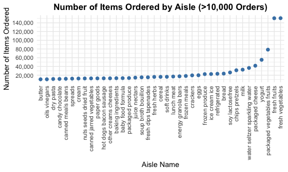

Homework3_zc2823
================
2025-10-07

# Problem 1

Loading data and read ‘instacart’

``` r
data("instacart")
```

### Size and Structure of the data

``` r
n_obs <- nrow(instacart)
n_vars <- ncol(instacart)

glimpse(instacart)
```

    ## Rows: 1,384,617
    ## Columns: 15
    ## $ order_id               <int> 1, 1, 1, 1, 1, 1, 1, 1, 36, 36, 36, 36, 36, 36,…
    ## $ product_id             <int> 49302, 11109, 10246, 49683, 43633, 13176, 47209…
    ## $ add_to_cart_order      <int> 1, 2, 3, 4, 5, 6, 7, 8, 1, 2, 3, 4, 5, 6, 7, 8,…
    ## $ reordered              <int> 1, 1, 0, 0, 1, 0, 0, 1, 0, 1, 0, 1, 1, 1, 1, 1,…
    ## $ user_id                <int> 112108, 112108, 112108, 112108, 112108, 112108,…
    ## $ eval_set               <chr> "train", "train", "train", "train", "train", "t…
    ## $ order_number           <int> 4, 4, 4, 4, 4, 4, 4, 4, 23, 23, 23, 23, 23, 23,…
    ## $ order_dow              <int> 4, 4, 4, 4, 4, 4, 4, 4, 6, 6, 6, 6, 6, 6, 6, 6,…
    ## $ order_hour_of_day      <int> 10, 10, 10, 10, 10, 10, 10, 10, 18, 18, 18, 18,…
    ## $ days_since_prior_order <int> 9, 9, 9, 9, 9, 9, 9, 9, 30, 30, 30, 30, 30, 30,…
    ## $ product_name           <chr> "Bulgarian Yogurt", "Organic 4% Milk Fat Whole …
    ## $ aisle_id               <int> 120, 108, 83, 83, 95, 24, 24, 21, 2, 115, 53, 1…
    ## $ department_id          <int> 16, 16, 4, 4, 15, 4, 4, 16, 16, 7, 16, 4, 16, 2…
    ## $ aisle                  <chr> "yogurt", "other creams cheeses", "fresh vegeta…
    ## $ department             <chr> "dairy eggs", "dairy eggs", "produce", "produce…

### Examples of observations

``` r
example_rows <- instacart |> 
  slice_sample(n = 5)

example_rows
```

    ## # A tibble: 5 × 15
    ##   order_id product_id add_to_cart_order reordered user_id eval_set order_number
    ##      <int>      <int>             <int>     <int>   <int> <chr>           <int>
    ## 1  1107870      33731                 6         0  197159 train               5
    ## 2   304371      28199                 2         1   46980 train              10
    ## 3  2113105      44669                13         1   51853 train              60
    ## 4    60897      36011                 7         1  141234 train              16
    ## 5  3319391       6873                 7         1  171343 train              11
    ## # ℹ 8 more variables: order_dow <int>, order_hour_of_day <int>,
    ## #   days_since_prior_order <int>, product_name <chr>, aisle_id <int>,
    ## #   department_id <int>, aisle <chr>, department <chr>

#### Short Description of the data

The Instacart dataset contains information on 1,384,617 observations and
15 variables, each corresponding to a single product added to a
customer’s online grocery order. Each row represents one product within
an order, while columns describe identifiers, product details, and
timing information for that purchase, and multiple rows can belong to
the same order or user.

Key variables include `order_id` and `user_id` for identifying orders
and customers, `product_name` describing the purchased items, `aisle`
and `department` indicating the product’s physical or categorical
location within the store (for example, yogurt in the dairy eggs
department), and `order_dow` and `order_hour_of_day` capturing when the
purchases occurred. Also, the variable `reordered` flags whether the
product had been previously purchased by the same user.

For example, a sample of five observations shows that user 197159 placed
an order (`order_id` 1107870) where `product_id` 33731 was added as the
6th item in the cart and was not ordered by this user in the past.

#### How many aisles are there, and which aisles are the most items ordered from?

Count the number of orders from each aisle

``` r
aisle_counts <- instacart |>
  count(aisle, name = "n_orders") |>
  arrange(desc(n_orders))
```

Total number of aisles

``` r
n_aisles <- nrow(aisle_counts)
n_aisles
```

    ## [1] 134

Display the top aisles by number of items ordered

``` r
head(aisle_counts, 10)
```

    ## # A tibble: 10 × 2
    ##    aisle                         n_orders
    ##    <chr>                            <int>
    ##  1 fresh vegetables                150609
    ##  2 fresh fruits                    150473
    ##  3 packaged vegetables fruits       78493
    ##  4 yogurt                           55240
    ##  5 packaged cheese                  41699
    ##  6 water seltzer sparkling water    36617
    ##  7 milk                             32644
    ##  8 chips pretzels                   31269
    ##  9 soy lactosefree                  26240
    ## 10 bread                            23635

##### Answer

There are 134 aisles in the Instacart dataset. Among them, the aisles
with the largest number of items ordered are fresh vegetables (150,609
orders) and fresh fruits (150,473 orders), followed by packaged
vegetables fruits, yogurt, and packaged cheese.

#### Make a plot that shows the number of items ordered in each aisle, limiting this to aisles with more than 10000 items ordered. Arrange aisles sensibly, and organize the plot

Count and keep aisles with \> 10,000 items ordered and Plot

``` r
instacart %>%
  group_by(aisle) %>%
  summarize(n = n()) %>%
  filter(n > 10000) %>%
  ggplot(aes(x = reorder(aisle, n), y = n)) +
  geom_point(color = "steelblue", size = 2) +
  scale_y_continuous(
    breaks = seq(0, 150000, by = 20000),   
    labels = scales::comma                 
  ) +
  theme_minimal() +
  theme(
    axis.text.x = element_text(angle = 90, hjust = 1, vjust = 0.5),
    plot.title = element_text(hjust = 0.5, face = "bold")
  ) +
  labs(
    title = "Number of Items Ordered by Aisle (>10,000 Orders)",
    x = "Aisle Name",
    y = "Number of Items Ordered"
  )
```



#### Make a table showing the three most popular items in each of the aisles “baking ingredients”, “dog food care”, and “packaged vegetables fruits”.

Three target aisles

``` r
target_aisles <- c("baking ingredients", "dog food care", "packaged vegetables fruits")
```

Find top 3 products in each aisle

``` r
top3_items <- instacart %>%
  filter(aisle %in% target_aisles) %>%
  group_by(aisle, product_name) %>%
  summarize(`Times item ordered` = n(), .groups = "drop_last") %>%
  slice_max(`Times item ordered`, n = 3) %>%
  arrange(aisle, desc(`Times item ordered`))
```

Display as a clean table

``` r
kable(top3_items, caption = "Top 3 Most Frequently Ordered Products in Selected Aisles")
```

| aisle | product_name | Times item ordered |
|:---|:---|---:|
| baking ingredients | Light Brown Sugar | 499 |
| baking ingredients | Pure Baking Soda | 387 |
| baking ingredients | Cane Sugar | 336 |
| dog food care | Snack Sticks Chicken & Rice Recipe Dog Treats | 30 |
| dog food care | Organix Chicken & Brown Rice Recipe | 28 |
| dog food care | Small Dog Biscuits | 26 |
| packaged vegetables fruits | Organic Baby Spinach | 9784 |
| packaged vegetables fruits | Organic Raspberries | 5546 |
| packaged vegetables fruits | Organic Blueberries | 4966 |

Top 3 Most Frequently Ordered Products in Selected Aisles

#### Make a table showing the mean hour of the day at which Pink Lady Apples and Coffee Ice Cream are ordered on each day of the week

Target two products

``` r
target_products <- c("Pink Lady Apples", "Coffee Ice Cream")
```

Make labels

``` r
dow_labels <- c("Sun", "Mon", "Tue", "Wed", "Thu", "Fri", "Sat")
```

Calculate the mean hour and transform it into a wider format

``` r
mean_hour_table <- instacart %>%
  filter(product_name %in% target_products) %>%
  mutate(order_dow = factor(order_dow, levels = 0:6, labels = dow_labels)) %>%
  group_by(product_name, order_dow) %>%
  summarize(`Mean order hour` = mean(order_hour_of_day), .groups = "drop") %>%
  pivot_wider(
    names_from = order_dow,
    values_from = `Mean order hour`
  ) %>%
  arrange(product_name)
```

Output a clean table

``` r
kable(mean_hour_table, digits = 2,
      caption = "Mean Hour of the Day When Selected Items Are Ordered")
```

| product_name     |   Sun |   Mon |   Tue |   Wed |   Thu |   Fri |   Sat |
|:-----------------|------:|------:|------:|------:|------:|------:|------:|
| Coffee Ice Cream | 13.77 | 14.32 | 15.38 | 15.32 | 15.22 | 12.26 | 13.83 |
| Pink Lady Apples | 13.44 | 11.36 | 11.70 | 14.25 | 11.55 | 12.78 | 11.94 |

Mean Hour of the Day When Selected Items Are Ordered
